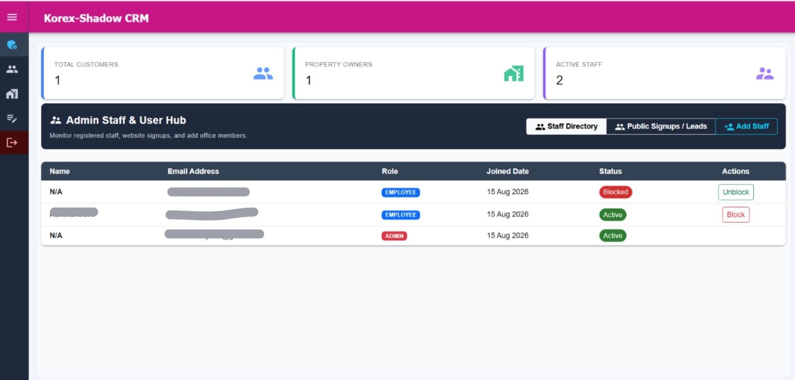
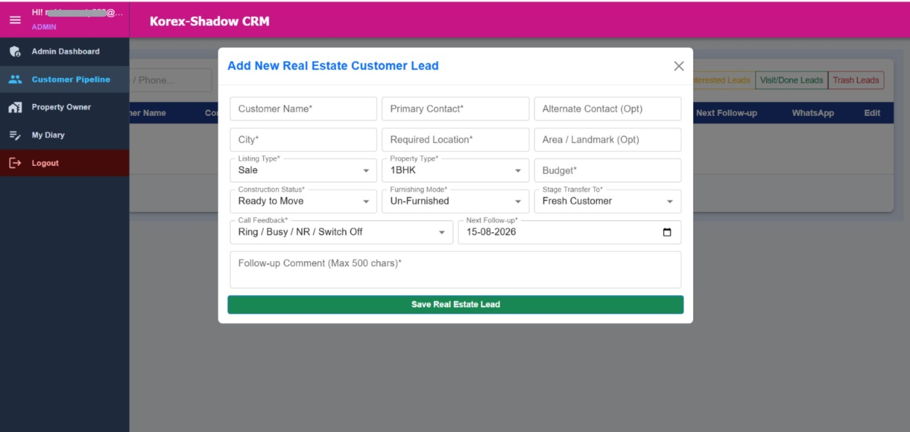
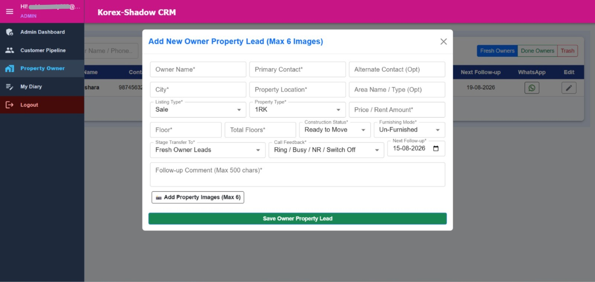
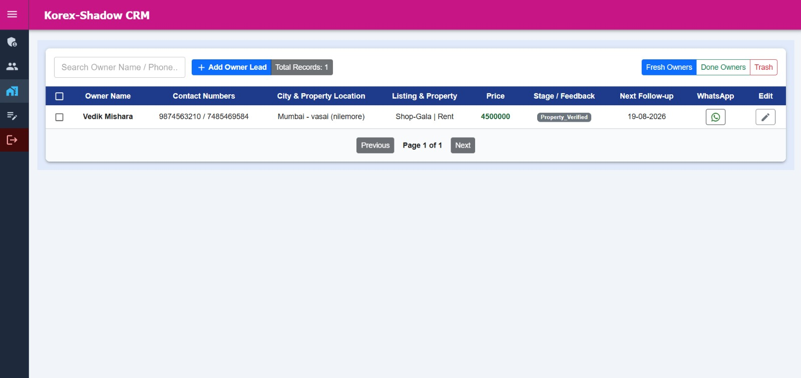
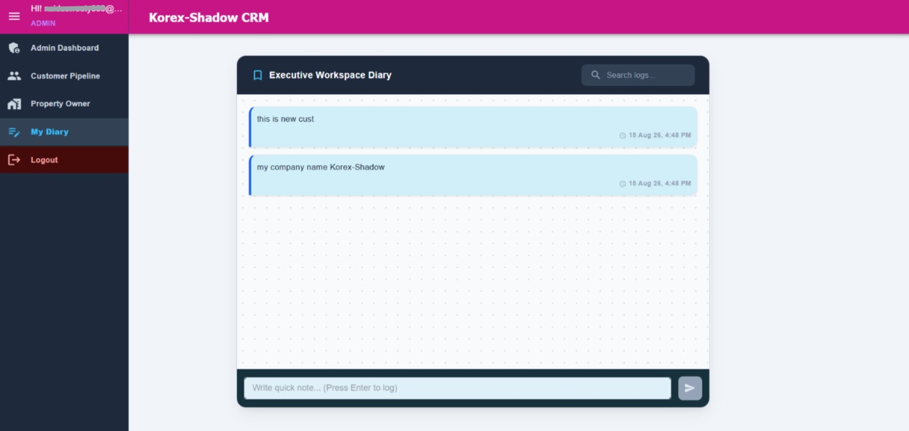

# 🏢 Korex RealEstate Enterprise CRM
> **Production-Ready Multi-Pipeline Real Estate ERP & Lead Management System** > Built with **Django 6 REST Framework**, **React 19 Vite**, **Redux Toolkit**, and **Material-UI (MUI)**.

[-orange?style=for-the-badge&logo=gumroad)](https://sweetynaidu1.gumroad.com/l/korex-realestate-crm)

---

## 📸 Application Preview

  <b>1. Enterprise Admin Dashboard & Analytics</b> 
  

  <b>2. Multi-Stage Customer Pipeline & Filters</b> 
  

  <b>3. Owner & Property Asset Directory</b> 
  

  <b>4. Threaded Follow-up Timeline & Dynamic Status Modal</b> 
  

  <b>5. WhatsApp Chat-Style Staff Activity Diary</b> 
  

## 🌟 Key Enterprise Capabilities
- 👥 **Dual Pipeline Management:** Customer 4-stage pipeline + Owner/Property photo inventory with automated image compression (Pillow).
- ⏰ **12:00 AM Automated Follow-up Rollover:** Smart priority scheduling without overriding future slots.
- ⚡ **2-Hour Auto-Bump Engine:** Resurfaces recently updated leads into active queues.
- 💬 **WhatsApp Chat-Style Staff Diary:** Quick conversational action logs.
- 🛡️ **Role-Based Security:** JWT Token gatekeeping, OTP verification & soft-delete protection.
- 📊 **One-Click Backup & WhatsApp Actions:** Instant client WhatsApp messaging & Excel/CSV data exports.

---

## 💻 Tech Stack
- **Frontend:** React 19, Vite, Redux Toolkit, Material-UI (MUI), React Hook Form, Axios.
- **Backend:** Django 6, Django REST Framework, SimpleJWT, Pillow, Pandas, Openpyxl.
- **Database:** PostgreSQL / SQLite ready.

---

## 📦 Commercial Package Includes
- ✅ Complete Clean Django Backend & React Frontend Source Code
- ✅ Pre-configured `.env` variables setup
- ✅ Step-by-Step Local Setup Guide (`README.md`)
- ✅ VPS Production (Ubuntu + Nginx + Gunicorn) Deployment Guide (`SERVER_HOST_GUIDE.md`)

🛒 **[Click Here to Purchase Full Source Code on Gumroad ($29)](https://sweetynaidu1.gumroad.com/l/korex-realestate-crm)**